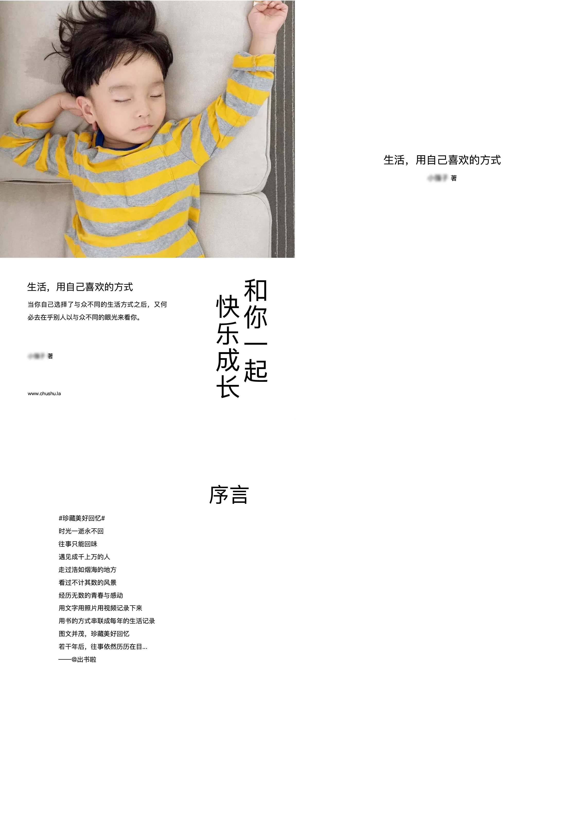
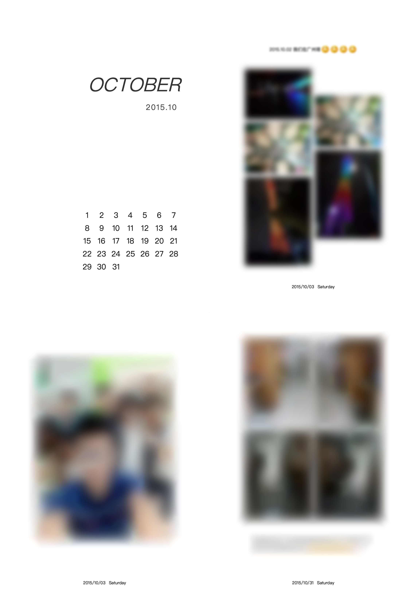
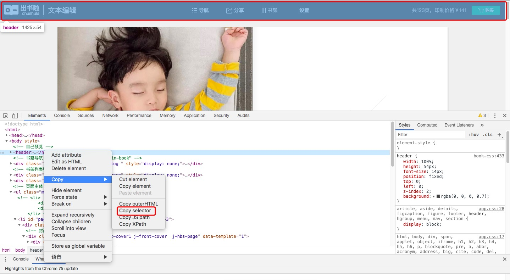
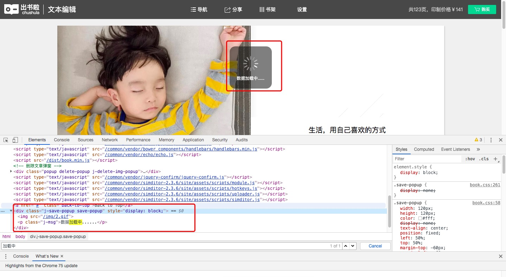
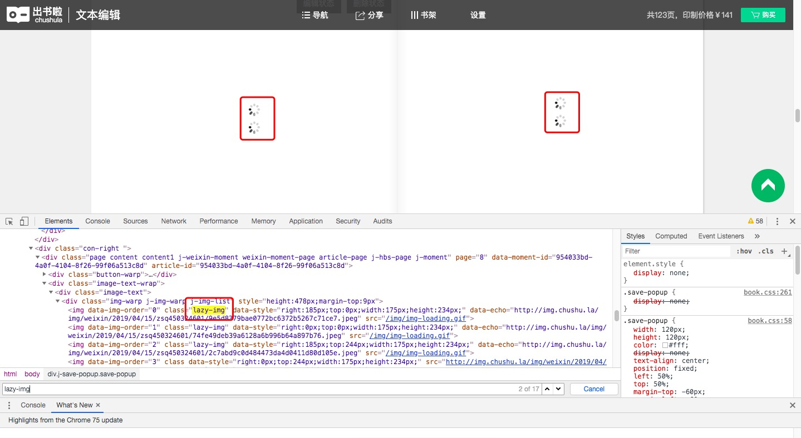

# 10.一键生成个人微信朋友圈数据电子书


## 简介

微信朋友圈保留着你的数据，它留住了美好的回忆，记录了我们成长的点点滴滴。发朋友圈从某种意义上来讲是在记录生活，感受生活，并从中看到了每个人每一步的成长。

这么一份珍贵的记忆，何不将它保存下来呢？只需一杯咖啡的时间，即可一键打印你的朋友圈。它可以是纸质书，也可以是电子书，可以长久保存，比洗照片好，又有时间足迹记忆。

- 这本书，可以用来：
- 送给孩子的生日礼物
- 送给伴侣的生日礼物
- 送给未来的自己
- ……

现在，你可以选择打印电子书或者纸质书。打印纸质书的话，可以找第三方机构花钱购买；**打印电子书的话，我们完全可以自己动手生成，这可以省下一笔不小的开支**。


## 部分截图

在开始写代码思路之前，我们先看看最终生成的效果。

### 电子书效果



### 纸质书效果(图片引用自[心书](https://weixinshu.com/library/unboxing))


## 代码思路

### 获取微信书链接
看完效果图之后，开始进入代码编写部分。首先，由于朋友圈数据的隐私性较高，手动获取的话，需要使用root的安卓手机进行解密或对pc端备份的聊天记录数据库进行解密，这对大部分人来说难度较大。所以我们采取的思路是基于现有的数据进行打印电子书。

目前，已经有第三方服务支持导出朋友圈数据，微信公众号【出书啦】就提供了这样一种服务。这种服务很大可能性是基于安卓模拟器进行自动化采取操作的，具体就不详细讲了。

首先，关注该公众号，然后开始制作微信书。该过程为小编添加你为好友，然后你将朋友圈开放给他看，等一会后采集完毕后，小编会发给你一个专属链接，这个链接里面的内容就是你的个人朋友圈数据。

### 生成电子书
有了这个链接后，我们开始对该页面的内容进行打印。

整个过程基于selenium自动化操作，如果你有了解过selenium的话，那么其实该过程是很简单的。

首先，引导用户输入微信书链接，我们采用在浏览器弹出一个输入文本框的形式让用户输入数据。
首先，在selenium中执行js代码，js代码中完成弹出输入文本框的功能。

#### 输入微信书链接

```python
# 以网页输入文本框形式提示用户输入url地址
def input_url():
    # js脚本
    random_id = [str(random.randint(0, 9)) for i in range(0,10)]
    random_id = "".join(random_id)
    random_id = 'id_input_target_url_' + random_id
    js = """
        // 弹出文本输入框，输入微信书的完整链接地址
        target_url = prompt("请输入微信书的完整链接地址","https://");
        // 动态创建一个input元素
        input_target_url = document.createElement("input");
        // 为其设置id，以便在程序中能够获取到它的值
        input_target_url.id = "id_input_target_url";
        // 插入到当前网页中
        document.getElementsByTagName("body")[0].appendChild(input_target_url);
        // 设置不可见
        document.getElementById("id_input_target_url").style.display = 'none';
        // 设置value为target_url的值
        document.getElementById("id_input_target_url").value = target_url
    """
    js = js.replace('id_input_target_url', random_id)

    # 执行以上js脚本
    driver.execute_script(js)

```
上述js代码的具体步骤为：弹出一个输入文本框，创建一个动态元素，随机命名该元素的id，并将这个动态元素插入到当前页面中，使得可以在python中通过selenium获取到输入文本框的内容。

接着，在selenium中检测是否存在该弹框，如果不存在则获取该弹框的内容，并进行后续步骤，该过程代码如下：
```python
# 执行以上js脚本
driver.execute_script(js)
# 判断弹出框是否存在
while(True):
    try:
        # 检测是否存在弹出框
        alert = driver.switch_to.alert
        time.sleep(0.5)
    except:
        # 如果抛异常，说明当前页面不存在弹出框，即用户点击了取消或者确定
        break
# 获取用户输入的链接地址
target_url = WebDriverWait(driver, 20).until(EC.presence_of_element_located((By.ID, random_id)))
value = target_url.get_attribute('value')
# 删除空格
value = value.strip() 
```

至此，`value`的值即为弹出框返回的内容。(你可能会问，直接另value=微信书链接不就可以了吗？事实上确实可以 >_<|||，但是采用上述方式会有一个良好的交互效果，同时可以加深一下对selenium的了解程度^_^)

#### 设置浏览器参数

当用户输入链接完毕后，开始对浏览器进行初始化设置。首先设置`chromedriver`路径，可输入绝对路径或者相对路径，./表示当前目录下。不同系统和不同chrome版本需要下载不同的chromedriver，请下载合适自己的版本，chromedriver下载地址[http://chromedriver.chromium.org/](http://chromedriver.chromium.org/downloads)

接着，设置自动打印成pdf，这样就可以默认打印成pdf了，省得我们手动打印，该步骤代码如下：
```python
appState = {
    # 添加保存为pdf选项
    "recentDestinations": [
        {
            "id": "Save as PDF",
            "origin": "local",
             "account":""
        }
    ],
    # 选择保存为pdf选项
    "selectedDestinationId": "Save as PDF",
    # 版本2
    "version": 2,
    # 不显示页眉页脚
    "isHeaderFooterEnabled": False
}
```

同时，设置自动打印模式，该步骤代码如下：

```python
profile = {
    # 打印前置参数
    'printing.print_preview_sticky_settings.appState': json.dumps(appState),
    # 默认下载、打印保存路径
    'savefile.default_directory': os.getcwd()
}
```

通过这两步，就实现了全自动打印效果。

#### 分析网页元素

接下来到了最关键的步骤，即分析网页元素。这个步骤我们可以顺便学习下基本的css，js知识。

首先，按F12打开网页调试工具，对页面上不必要的元素进行隐藏


我们可以看到，顶部的导航栏可能会影响打印效果，所以，我们将它隐藏。在调试工具中，选择Copy Selector，得到返回的数据为`body > header`，通过selenium隐藏该元素的代码如下：
```python
# 隐藏导航栏，防止影响截图效果
js = 'document.querySelector("body > header").style.display="none";'
driver.execute_script(js)
```

我们又发现，当前页面显示的数据只包含某个月朋友圈的数据，而不是所有朋友圈数据，那么如何显示出所有朋友圈数据呢？通过分析可知，当点击“下一月”按钮后，会有新的元素显示，而原来的元素被隐藏，而被隐藏的元素就是前面月份的数据。所以我们只要遍历到最后一个月后，把前面所有元素显示出来再打印就OK了。那么，如何判断是最后一个月呢？我们通过分析又可知，当不是最后一个月时，“下一月”的class名为`next-month`，而当在最后一月时，“下一月”的class名为`next-month disable`，因此我们可以检测它的class名进而知道是否处于最后一个月。该步骤代码如下：
```python
# 判断当下一月控件的class name 是否为next-month disable，如果是，则说明翻到最后一月了
page_source = driver.page_source

# 每一个element代表每一页，将每一页中style的display属性改成block，即可见状态
for index, element in enumerate(element_left_list):
    # ..在xpath中表示上一级的元素，也就是父元素
    parent_element = element.find_element_by_xpath('..')
    # 获取这个父元素的完整id
    parent_element_id = parent_element.get_attribute('id')

    # 将该父元素更改为可见状态
    js = 'document.getElementById("{}").style.display="block";'.format(parent_element_id)
    driver.execute_script(js)
```

但是，这样会出现一个问题，即使我们成功打印了，但是我们不难保证页面上的元素全部加载完成了，所以可能导致打印后某些元素没有显示出来，导致不是非常好看。因此，需要判断何时加载结束。



通过分析我们得知，当网页元素没加载完毕时，会有一个“loading”提示，当网页元素加载完毕后，该元素隐藏起来了。因此，我们可以判断该元素是否隐藏来得知当前页面元素是否加载完毕。该部分代码如下：
```python
# 等待当前页面所有数据加载完毕，正常情况下数据加载完毕后，这个‘加载中’元素会隐藏起来
while (True):
    loading_status = WebDriverWait(driver, 20).until(
        EC.presence_of_element_located((By.CSS_SELECTOR, 'div.j-save-popup.save-popup')))
    if (loading_status.is_displayed() == False):
        break
```

可是，我们又发现，及时等待网页元素加载完毕了，还是有部分图片没有显示出来。


这就纳闷了，是为什么呢？通过分析我们又得知，这些图片处于加载状态的时候，class名为`lazy-img`，通过字面意思，我们大概可以猜得出它是懒加载的意思，也就是用户滑动页面到那里时才进行加载，以便节省服务器压力。

所以我们可以通过滑动到每一个class名为`lazy-img`的元素，使得它进行加载。那么？一个合适的方法就是，通过js定位到该元素，直到所有class名为`lazy-img`的元素不存在。

```python
while(True):
    try:
        lazy_img = driver.find_elements_by_css_selector('img.lazy-img')
        js = 'document.getElementsByClassName("lazy-img")[0].scrollIntoView();'
        driver.execute_script(js)
        time.sleep(3)
    except:
        # 找不到控件img.lazy-img，所以退出循环
        break
```

其中，`document.getElementsByClassName("lazy-img")[0]`指的是`document.getElementsByClassName("lazy-img")`的第一个元素，`scrollIntoView()`指的是滚动到该元素的位置


#### 打印电子书

通过上述步骤，我们已经成功地隐藏部分可能会影响外观的元素，同时也显示所有所需的元素，接下来，就差打印部分了。可以直接通过js代码唤起浏览器打印功能，并且，之前我们已经设置为自动打印pdf格式了，所以它将自动打印为pdf。但是，打印到哪里呢？这里需要设置下浏览器默认存储位置，保存的位置为当前目录。该步骤代码如下：
```python
# 默认下载、打印保存路径
'savefile.default_directory': os.getcwd()

# 调用chrome打印功能
driver.execute_script('window.print();')
```

打印完成后，设置退出浏览器`driver.quit()`


经过测试，该电子书为**超清版本**，大小约**16MB**，所以质量还算不错的。


## 如何运行
```bash
# 跳转到当前目录
cd 目录名
# 先卸载依赖库
pip uninstall -y -r requirement.txt
# 再重新安装依赖库
pip install -r requirement.txt
# 开始运行
python main.py
```


## 补充

完整版源代码存放在[github][5]上，有需要的可以下载

项目持续更新，欢迎您[star本项目][5]

## License
[The MIT License (MIT)][6]

[5]:https://github.com/shengqiangzhang/examples-of-web-crawlers
[6]:http://opensource.org/licenses/MIT
